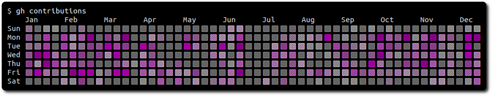

# gh-contributions

A small [GitHub CLI](https://cli.github.com/) extention for showing your contributions.



## Install

Install [GitHub CLI](https://cli.github.com/) and run:

```
gh extension install jeppefrandsen/gh-contributions
```

## Hacking

The icon can be changed to any from the [Unicode Character Table](https://unicode-table.com/en/blocks/) but some might not be available default in your terminal. The colors is an array of [xterm](https://robotmoon.com/256-colors/) supported colors and the number of colors is just the length of the array. Happy hacking 🍻
